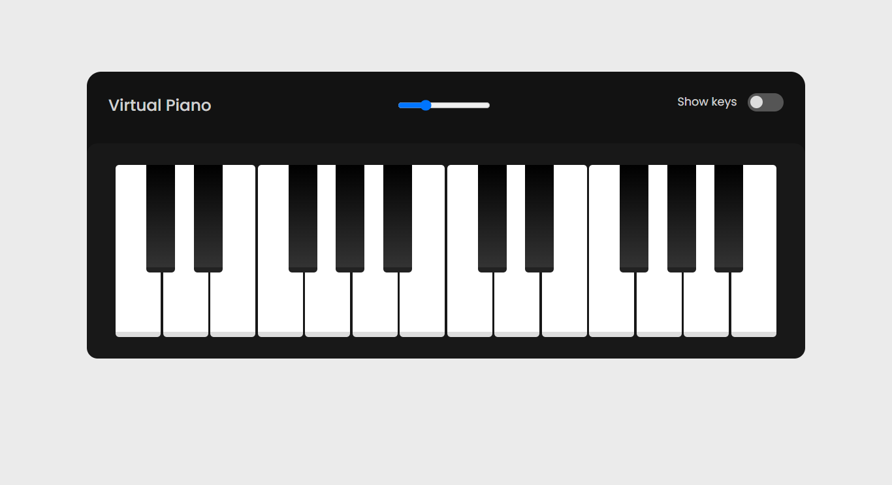

# Projeto Virtual Piano

## 💻 _virtualPiano_

Se divirta e passe o tempo tocando um piano virtual 100% funcional.

## 💻 Projeto desenvolvido

<a href="https://gabrieldiasdev.github.io/virtualPiano/" target="_blank">Acesse o projeto</a>

## 💡 Info

O projeto contém uma interface moderna inspirada em um piano, podendo ser tocado através do clique do seu mouse ou até mesmo pelas teclas do seu teclado;

## 🔨 Funcionalidades

-   Tocar o piano através do mouse ou teclado.
-   Alterar volume do piano.
-   Mostrar ou esconder teclas no piano.

## 💻 Tecnologias/Pacotes utilizados

**Frontend**

-   Html
-   Css
-   Javascript

## 👨‍💻 Autor

Gabriel Dias Catarin, desenvolvedor web | Bauru, São Paulo

[ LinkedIn](https://www.linkedin.com/in/gabriel-dias-260857207/)
&nbsp;
